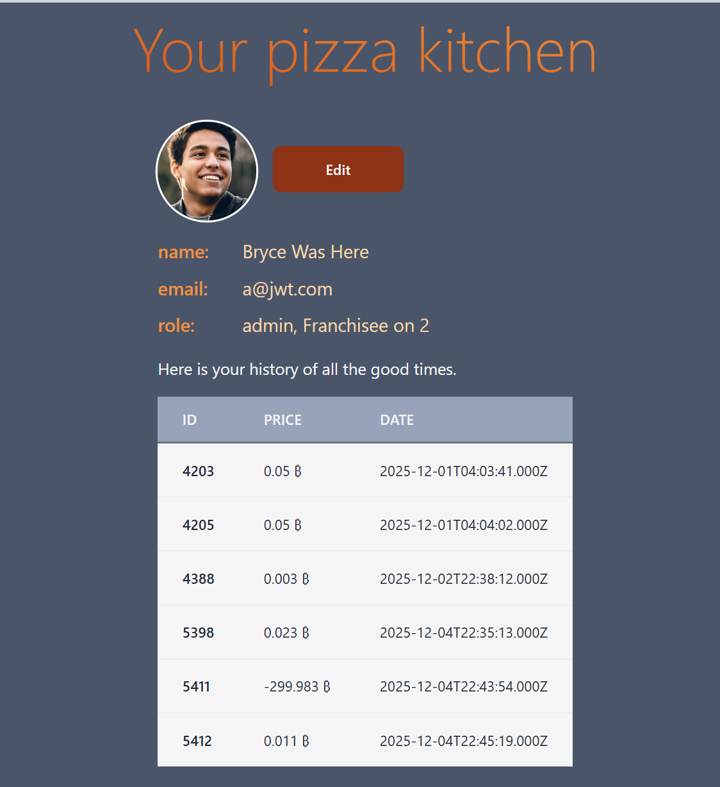
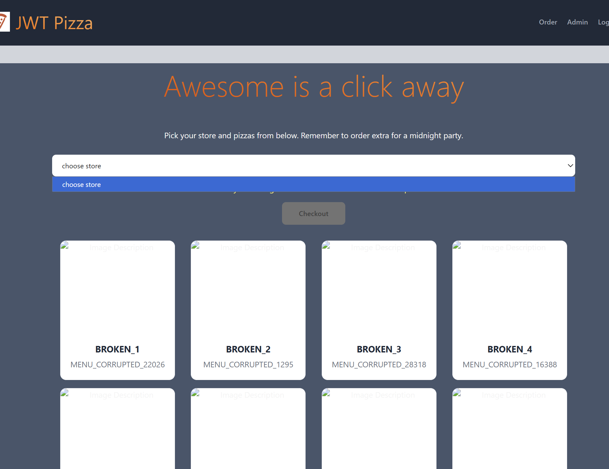

## Details of Bryce Lasson's Penetration Testing
### Bryce Lasson Self Penetration Test
| Item | Result |
| ---- | ------ |
| Date           | December 4th 2025 |
| Target         | [https://pizza.brycelasson.click](https://pizza.brycelasson.click) |
| Classification | SQL Injection |
| Severity       | 1 |
| Description    | I tested SQL injection throughout my platform, and the user update fields were vulnerable, allowing certain expressions to run. However, multiline statements were blocked, preventing destructive actions like dropping tables. |
| Images         | None |
| Corrections    | I updated the system to sanitize input and switched to attaching values as parameters instead of injecting them directly into SQL strings. |

### Bryce Lasson Peer Penetration Test
| Item | Result |
| ---- | ------ |
| Date           | December 2025 |
| Target         | [https://pizza-service.jtdevops.click](https://pizza-service.jtdevops.click) |
| Classification | Identification and Authentication Failures |
| Severity       | 3 |
| Description    | I used `curl` to hit the peer's registration endpoint and successfully created an admin account due to insufficient backend validation. |
| Images         |  |
| Corrections    | The site should restrict admin creation on the public registration route and enforce backend side role validation. |

| Item | Result |
| ---- | ------ |
| Date           | December 2025 |
| Target         | [https://pizza-service.jtdevops.click](https://pizza-service.jtdevops.click) |
| Classification | Broken Access Control |
| Severity       | 4 |
| Description    | Using `curl` with the admin token, I deleted all stores and franchises. I then inserted broken menu items with no images, negative prices, and other nonsensical values, which severely hindered system usability. |
| Images         |  |
| Corrections    | Require stricter authorization checks, validate menu fields (images, price >= 0), and restrict destructive operations to dual factor verified admin sources. |

### Summary of Learnings: Bryce Lasson
* SQL Injection is a major threat when user input is directly concatenated into queries. Even partially successful injections can lead to other errors such as broken access control. Using parameterized queries completely eliminated this type of attack.
* Client side validation cannot be trusted, since any attacker can modify HTML, remove required fields, or craft manual requests. Authentication logic must be enforced on the server side.
* Once an attacker gains elevated privileges, endpoints that allow deletion or insertion of sensitive records can quickly destroy the application’s integrity.
* My code can be incredibly secure, but the infrastructure I use to manage and deploy it can introduce major vulnerabillities too, such as leaving requests open to all sources instead of just the main application's IP address.

## Details of James Teuscher's Penetration Testing
### James Teuscher Self Penetration Test

| Item           | Result                                                                                                                                                                                               |
| -------------- | ---------------------------------------------------------------------------------------------------------------------------------------------------------------------------------------------------- |
| Date           | December 4, 2025                                                                                                                                                                                     |
| Target         | https://pizza-service.jtdevops.click/                                                                                                                                                                |
| Classification | Insecure Design                                                                                                                                                                                      |
| Severity       | 2-3                                                                                                                                                                                                  |
| Description    | HTTP Requests to Pizza Factory were intercepted and prices of JWT Pizzas decreased, resulting in loss of revenue. I was able to do this attack in class as Dr. Jensen demonstrated it.               |
| Image          |  Pizza price is 0 (Free pizzas!)                                                                                                                |
| Correction     | My peer could correct this by asserting that the price listed in the response from the pizza factory must equal the price of the pizza listed in the database. If the price differs, the order fails |

| Item           | Result                                                                                                                                                                                                                         |
| -------------- | ------------------------------------------------------------------------------------------------------------------------------------------------------------------------------------------------------------------------------ |
| Date           | December 4, 2025                                                                                                                                                                                                               |
| Target         | https://pizza-service.jtdevops.click/                                                                                                                                                                                          |
| Classification | Identification and Authentication Failures                                                                                                                                                                                     |
| Severity       | 0                                                                                                                                                                                                                              |
| Description    | I attempted to use a `cURL` command to hit the registration endpoint with correct parameters to make my own admin user, outside of the default one. After I couldn't execute this attack on my peer, I attempted it on myself. |
| Image          |  This attack failed, as I either did not hit the right endpoint or didn't have the right request body                                                                                  |
| Correction     | No correction is necessary because no attacks were successful.                                                                                                                                                                 |

| Item           | Result                                                                                                         |
| -------------- | -------------------------------------------------------------------------------------------------------------- |
| Date           | December 9, 2025                                                                                               |
| Target         | https://pizza-service.jtdevops.click/                                                                          |
| Classification | Identification and Authentication Failures                                                                     |
| Severity       | 0                                                                                                              |
| Description    | Attempted to use Burp Proxy and Repeater to send register requests with correct body to register an admin user |
| Image          |                                                   |
| Correction     | No correction seemed necessary since the attack was unsuccessful                                               |

### James Teuscher Peer Penetration Test
| Item           | Result                                                                                                                                                                                               |
| -------------- | ---------------------------------------------------------------------------------------------------------------------------------------------------------------------------------------------------- |
| Date           | December 4, 2025                                                                                                                                                                                     |
| Target         | https://pizza-service.brycelasson.click/                                                                                                                                                             |
| Classification | Insecure Design                                                                                                                                                                                      |
| Severity       | 2-3                                                                                                                                                                                                  |
| Description    | HTTP Requests to Pizza Factory were intercepted and prices of JWT Pizzas decreased, resulting in loss of revenue                                                                                     |
| Image          |  Pizza price is 0 (Free pizzas!)                                                                                                                |
| Correction     | My peer could correct this by asserting that the price listed in the response from the pizza factory must equal the price of the pizza listed in the database. If the price differs, the order fails |

| Item           | Result                                                         |
| -------------- | -------------------------------------------------------------- |
| Date           | December 4, 2025                                               |
| Target         | https://pizza-service.brycelasson.click/                       |
| Classification | Injection                                                      |
| Severity       | 0                                                              |
| Description    | Attempted SQL Injection attack using Burp Intruder Tool        |
| Image          |              |
| Correction     | No corrections seem necessary, as the attack was unsuccessful. |

| Item           | Result                                                                                                                                                                     |
| -------------- | -------------------------------------------------------------------------------------------------------------------------------------------------------------------------- |
| Date           | December 4, 2025                                                                                                                                                           |
| Target         | https://pizza-service.brycelasson.click/                                                                                                                                   |
| Classification | Identification and Authentication Failures                                                                                                                                 |
| Severity       | 0                                                                                                                                                                          |
| Description    | I recognized very low randomness in auth tokens, so I used a python script generated by Google Gemini to try and discover my peer's JWT secret and make my own auth tokens |
| Image          |  This attack failed, because I did not have enough time to work the script and crack the JWT secret                   |
| Correction     | Although the attack was not successful, it could be eliminated as a possibility by using a better hash function or similar algorithm for auth token generation.            |

| Item           | Result                                                                                                                                        |
| -------------- | --------------------------------------------------------------------------------------------------------------------------------------------- |
| Date           | December 4, 2025                                                                                                                              |
| Target         | https://pizza-service.brycelasson.click/                                                                                                      |
| Classification | Identification and Authentication Failures                                                                                                    |
| Severity       | 0                                                                                                                                             |
| Description    | I attempted to use a `cURL` command to hit the registration endpoint with correct parameters to make my own admin user                        |
| Image          |  This attack failed, as I either did not hit the right endpoint or didn't have the right request body |
| Correction     | No correction is necessary because no attacks were successful.                                                                                |

### Summary of Learnings: James Teuscher

- One of my biggest takeaways is that cyber defense requires just as much knowledge of attacks as offense. During the penetration testing, I felt fairly lost on how to attack my peer, but I also felt pretty lost on how to defend against their attacks, and recover from them. This makes me realize how critical a knowledge of cyber security is.
- Another takeaway for me was the importance of metrics. I was able to detect some of my peer's more subtle attacks/infiltrations because of my logging when these attacks weren't visible on the front end. This shows me that metrics and logging are critical for detecting *all* types of attacks.
- I think another takeaway for me is the importance of understanding all of the code, *from a security standpoint*. After Deliverable 1, and throughout the class, I felt I could confidently say that I knew the code for JWT Pizza pretty well. But, my understanding, even if it was good, was from more of a functional, software engineering standpoint. When it came to my security understanding of the code: what was safe, what was vulnerable, and *why* those things were safe or vulnerable, my understanding was, admittedly, virtually nonexistent. I think after this experience, I am more motivated to learn cyber security and be able to analyze code from a security standpoint.