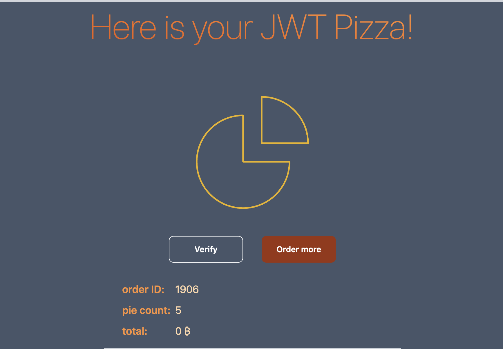
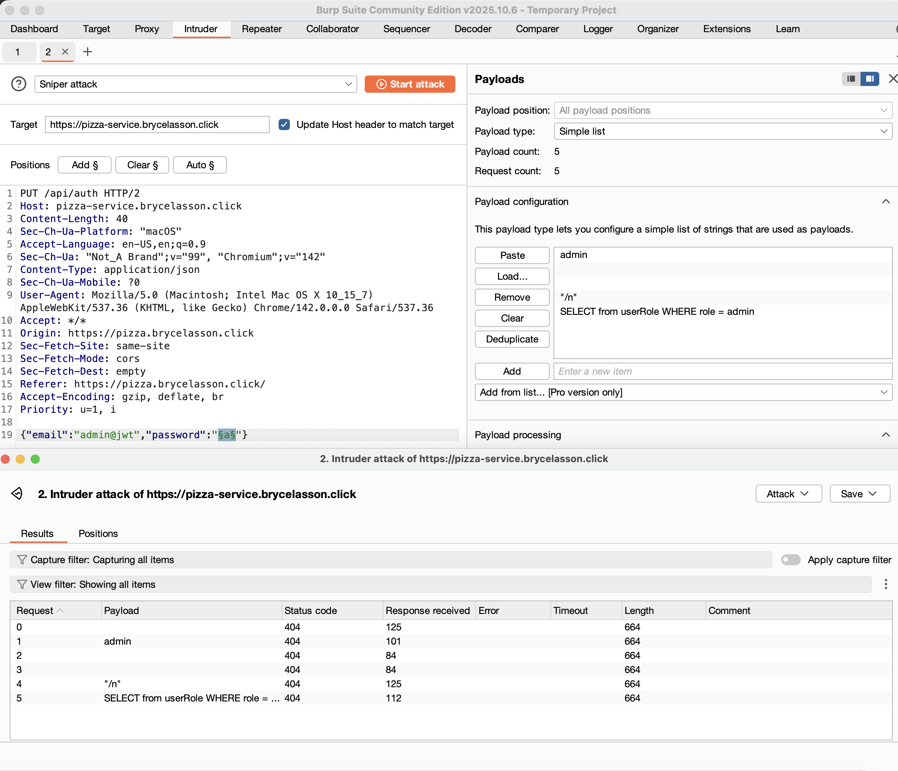
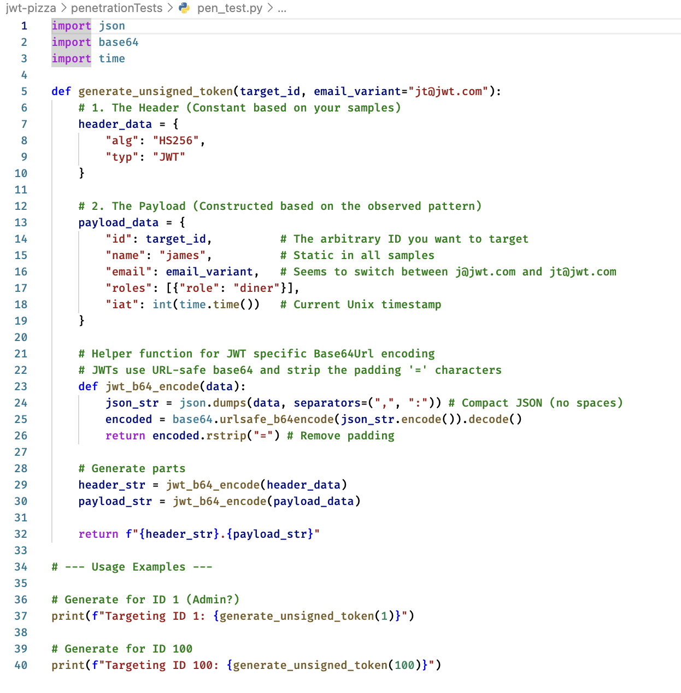
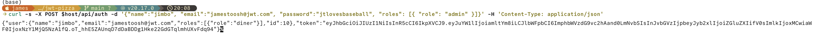

## Details of James Teuscher's Penetration Test on Peer Bryce Lasson

# JWT Pizza Peer Penetration Test

| Item           | Result                                                                                                                                                                                               |
| -------------- | ---------------------------------------------------------------------------------------------------------------------------------------------------------------------------------------------------- |
| Date           | December 4, 2025                                                                                                                                                                                     |
| Target         | https://pizza-service.brycelasson.click/                                                                                                                                                             |
| Classification | Insecure Design                                                                                                                                                                                      |
| Severity       | 2-3                                                                                                                                                                                                  |
| Description    | HTTP Requests to Pizza Factory were intercepted and prices of JWT Pizzas decreased, resulting in loss of revenue                                                                                     |
| Image          |  Pizza price is 0 (Free pizzas!)                                                                                                                |
| Correction     | My peer could correct this by asserting that the price listed in the response from the pizza factory must equal the price of the pizza listed in the database. If the price differs, the order fails |

| Item           | Result                                                         |
| -------------- | -------------------------------------------------------------- |
| Date           | December 4, 2025                                               |
| Target         | https://pizza-service.brycelasson.click/                       |
| Classification | Injection                                                      |
| Severity       | 0                                                              |
| Description    | Attempted SQL Injection attack using Burp Intruder Tool        |
| Image          |              |
| Correction     | No corrections seem necessary, as the attack was unsuccessful. |

| Item           | Result                                                                                                                                                                     |
| -------------- | -------------------------------------------------------------------------------------------------------------------------------------------------------------------------- |
| Date           | December 4, 2025                                                                                                                                                           |
| Target         | https://pizza-service.brycelasson.click/                                                                                                                                   |
| Classification | Identification and Authentication Failures                                                                                                                                 |
| Severity       | 0                                                                                                                                                                          |
| Description    | I recognized very low randomness in auth tokens, so I used a python script generated by Google Gemini to try and discover my peer's JWT secret and make my own auth tokens |
| Image          |  This attack failed, because I did not have enough time to work the script and crack the JWT secret                   |
| Correction     | Although the attack was not successful, it could be eliminated as a possibility by using a better hash function or similar algorithm for auth token generation.            |

| Item           | Result                                                                                                                                        |
| -------------- | --------------------------------------------------------------------------------------------------------------------------------------------- |
| Date           | December 4, 2025                                                                                                                              |
| Target         | https://pizza-service.brycelasson.click/                                                                                                      |
| Classification | Identification and Authentication Failures                                                                                                    |
| Severity       | 0                                                                                                                                             |
| Description    | I attempted to use a `cURL` command to hit the registration endpoint with correct parameters to make my own admin user                        |
| Image          |  This attack failed, as I either did not hit the right endpoint or didn't have the right request body |
| Correction     | No correction is necessary because no attacks were successful.                                                                                |

